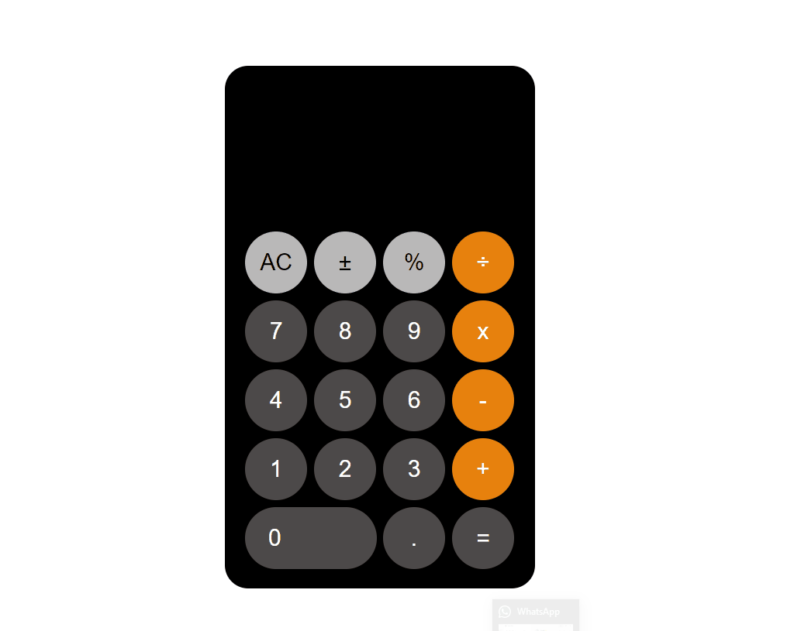

# IOS CALCULATOR HTML+CSS 



## Description
Project aims to create Ios Calculator page.

## Project Skeleton 

```
IOS CALCCULATOR(folder)
|
|----README.md
|----img
    |----Ios_Calculator.gif
|----index.html
|----style.css
```

## Objective

Build a Landing that is functionally similar to this: [IOS CALCULATOR](https://support.apple.com/en-mt/guide/iphone/iph1ac0b5cc/ios)


## What I used in this project?

- ## Html
- ## JS (I will add)
- ## Css
  - ### Grid
  - ### Flex
  - ### Transform

<left> ⌛ Happy Coding  💻🎶🍕🍀✍ </left>
